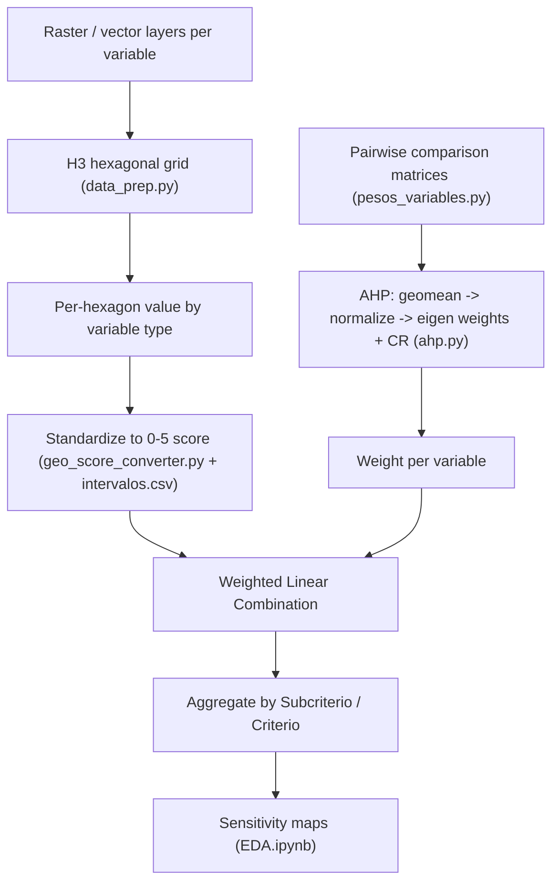

# AHP Ambiental — Environmental Multicriteria Suitability Model

A spatial multicriteria decision analysis (MCDA) model that estimates **environmental
sensitivity / suitability** over a study area by combining many environmental variables
into a single score per spatial unit. The model couples the **Analytic Hierarchy Process
(AHP)** for criterion weighting with a **Weighted Linear Combination (WLC)** over an
**H3 hexagonal grid**.

The output is a set of per-hexagon scores (per sub-criterion, criterion, and a final
aggregate) that can be mapped to identify more vs. less environmentally sensitive zones.

---

## 1. Conceptual framework

The model is a classic **GIS-MCDA** problem solved in two independent halves that are
multiplied together at the end:

1. **How important is each variable?** → answered by **AHP** pairwise comparisons
   (`ahp.py`, `pesos_variables.py`), producing a weight per variable.
2. **How favorable is each location for each variable?** → answered by **standardizing**
   every raw variable onto a common **0–5 suitability scale** (`geo_score_converter.py`,
   `intervalos.csv`).

The final suitability of a spatial unit is the weighted sum:

\[
S_{\text{cell}} = \sum_i w_i \cdot \text{score}_i(\text{cell})
\]

where \(w_i\) is the AHP weight of variable \(i\) and \(\text{score}_i \in [0,5]\) is its
standardized score in that cell.



---

## 2. Methodology, step by step

### Step 1 — Spatial discretization into an H3 grid
`data_prep.py` (`h3_grid`) builds a hexagonal grid (Uber's **H3**) covering the bounding
box of a reference raster, at a chosen resolution and CRS. Every variable is then resampled
onto this common grid so all layers share identical spatial units before scoring.

### Step 2 — Variable extraction by type
Each variable is classified into one of four **types** (column `Tipo` in
[`codigo_tipos(in).csv`](codigo_tipos(in).csv)), and extracted onto the grid accordingly
(`h3_grid.vars_ahp`):

| Tipo | Extraction (`data_prep.py`) | Meaning |
| --- | --- | --- |
| `binario` | `var_binarias`: spatial join presence → `0/1` | Presence/absence of a feature |
| `continua` | `var_continuas`: `zonal_stats` mean of raster | Continuous magnitude (slope, elevation, wind…) |
| `categorica` | `var_categoricas`: dominant class by area per hexagon | Land cover / lithology classes |
| `excluyente` | `var_excluyentes`: presence → `1` replaced by `NaN` | **Hard exclusion** (constraint), not a factor |

The factor-vs-constraint distinction is deliberate: `excluyente` layers mask cells out of
the analysis (`NaN`) rather than contributing a weighted score.

### Step 3 — Standardization to a 0–5 score
`GeoIntervalScorer` ([`geo_score_converter.py`](geo_score_converter.py)) converts each
raw column into a 0–5 suitability score using the breakpoints in
[`intervalos.csv`](intervalos.csv):

- **Categorica** — `build_label_dict` reads each interval column `0..5`, splits the
  `;`-separated labels, and maps every class label to its score.
- **Continua** — `_score_continuous` reads each interval as a `low;high` numeric range and
  assigns the interval index to values falling inside it.
- **Binario** — `_score_binary` maps `0 → 0` and `1 → 5`.
- **Excluyente** — `_score_excluyente` keeps `0 → 0` and `1 → NaN` (excluded).

#### Binary inversion (`Invertir`)
Some binary variables are *benefit* (presence is favorable) and some are *cost* (presence
is unfavorable). The `Invertir` flag in [`codigo_tipos(in).csv`](codigo_tipos(in).csv)
lets you flip a binary variable's final score (`0 ↔ 5`) without touching the data, so every
criterion points in the same "higher = more sensitive" direction. `NaN` and all non-binary
types are never inverted. Set `Invertir = si` on the codes you want flipped (`no` by
default).

The 0–5 scale used throughout:

| Score | Interpretation |
| --- | --- |
| 0 | Lowest sensitivity / least favorable |
| 5 | Highest sensitivity / most favorable |
| NaN | Excluded (constraint) or no data |

### Step 4 — AHP weighting
Weights come from **pairwise comparison matrices**, one per criterion group, defined in
[`pesos_variables.py`](pesos_variables.py) (`MATRICES_COLOMBIA`: *Especies Bióticas*,
*Áreas Protegidas*, *Amenazas*, *Geología/Geotecnia*). `Ahp_calc` in
[`ahp.py`](ahp.py) computes the priorities:

1. **Aggregation of decision-makers** — `geomean` takes the element-wise geometric mean of
   all judgment matrices (the standard *aggregation of individual judgments* for group AHP).
2. **Normalization** — `normalize_matrix` divides each column by its sum.
3. **Weights** — `define_weights` averages each row of the normalized matrix (priority
   vector / approximate principal eigenvector).
4. **Consistency** — `consistency_rate` computes \(\lambda_{max}\), the Consistency Index
   \(CI = (\lambda_{max}-n)/(n-1)\) and the Consistency Ratio \(CR = CI/RI\) using Saaty's
   Random Index table. A matrix is acceptable when \(CR < 0.1\).

`pesos_dict()` returns `{codigo: local weight}` for use in the aggregation.

### Step 5 — Weighted aggregation and mapping
In [`EDA.ipynb`](EDA.ipynb) the standardized scores are merged with the AHP weights, then
summed by **Subcriterio** and **Criterio** (`Subcriterio` column in
`codigo_tipos(in).csv`: *Areas, Especies, Condiciones, Amenazas*) to produce thematic and
final sensitivity layers, which are rendered as choropleth maps with `matplotlib`.

---

## 3. Data model

### `codigo_tipos(in).csv`
The variable registry. One row per variable code (`AMB-XXX`):

| Column | Description |
| --- | --- |
| `Codigo` | Unique variable code (e.g. `AMB-006-A`) |
| `Variable` | Human-readable name |
| `Tipo` | `binario` / `continua` / `categorica` / `excluyente` |
| `Subcriterio` | Thematic group used for aggregation |
| `Criterio` | (Reserved / higher-level grouping) |
| `Invertir` | `si` to flip a binary score `0↔5`, `no` otherwise |

### `intervalos.csv`
The scoring rubric. One row per code, columns `0..5` holding either:
- `;`-separated **class labels** (categorica), or
- `low;high` **numeric ranges** (continua).

---

## 4. Repository structure

| Path | Purpose |
| --- | --- |
| [`ahp.py`](ahp.py) | AHP engine: geomean, normalization, weights, consistency ratio |
| [`pesos_variables.py`](pesos_variables.py) | Pairwise comparison matrices + weight export |
| [`data_prep.py`](data_prep.py) | H3 grid construction and per-type variable extraction |
| [`geo_score_converter.py`](geo_score_converter.py) | Standardization of variables to 0–5 scores |
| [`codigo_tipos(in).csv`](codigo_tipos(in).csv) | Variable registry (type, grouping, inversion) |
| [`intervalos.csv`](intervalos.csv) | Scoring breakpoints per variable |
| [`EDA.ipynb`](EDA.ipynb) | End-to-end run: scoring, weighting, aggregation, maps |
| `vars_ambiental_ahp/` | Source environmental layers per code |
| `requirements.txt` | Python dependencies |

---

## 5. Installation

```bash
python -m venv env
source env/bin/activate
pip install -r requirements.txt
```

Key dependencies: `geopandas`, `rasterio`, `rioxarray`, `xarray`, `rasterstats`, `h3`,
`shapely`, `fiona`, `pandas`, `numpy`, `matplotlib`.

---

## 6. Usage

```python
# 1. Build the H3 grid and extract every variable onto it
import rasterio
from data_prep import h3_grid
import pandas as pd

raster = rasterio.open("COL_wind-speed_10m.tif")
grid = h3_grid(raster, resolution=6, crs="EPSG:4326")
df_tipos = pd.read_csv("codigo_tipos(in).csv", sep=";", encoding="latin-1")
gdf = grid.vars_ahp("vars_ambiental_ahp", df_tipos)

# 2. Standardize raw values to 0-5 AHP scores
from geo_score_converter import GeoIntervalScorer
scored = GeoIntervalScorer().transform(gdf)

# 3. Get AHP weights and consistency
from pesos_variables import pesos_dict
weights = pesos_dict()           # {codigo: local weight}

# 4. Weighted combination per code -> aggregate by Subcriterio/Criterio
#    (see EDA.ipynb for the full aggregation and mapping)
```

To inspect the AHP weights and consistency ratios of every criterion group:

```bash
python pesos_variables.py
```

---

## 7. Notes and assumptions

- Scores are summed as if interval-scaled; ordinal `categorica` scores are treated the same
  way as numeric ones — a standard, accepted simplification in AHP-WLC.
- `binario 0 → 0` means absence contributes nothing to the weighted sum (absorbing zero).
  If a non-zero baseline is preferred, change the mapping in `_score_binary`.
- `excluyente` variables act as constraints (masking) rather than weighted factors.
- A judgment matrix should have **CR < 0.1** to be considered consistent.
